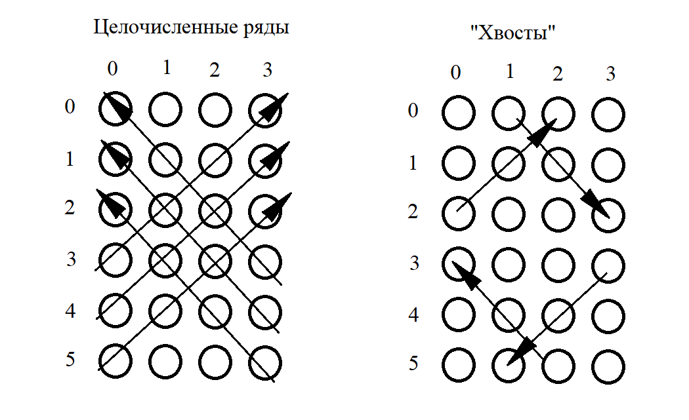

# DZ_Yuferov_JAVAcore_Sem1

## Домашнее задание.

### 1. Полностью разобраться с кодом программы разработанной на семинаре, переписать программу. Это минимальная задача для сдачи домашней работы.

Усложняем задачу:

### 2.* Переработать метод проверки победы, логика проверки победы должна работать для поля 5х5 иколичества фишек 4. Очень желательно не делать это просто набором условий для каждой из возможных ситуаций! Используйте вспомогательные методы, используйте циклы!

Последовательность проверки диагональных направлений следующая: сначала проверяются  целочисленные ряды и затем "хвостовые" окончания.
Размер "хвостов" зависит:
- во первых, от длины выигрышного ряда
- во вторых, от разности длин сторон игрового поля.
Вторая сторона "хвоста" расчитывается путем зеркального пересчета координат.

Функция - checkDiagonal(char dot) Разделена на две основные половины условием:  когда количество строк превышает количество столбцов и наоборот. Для каждого случая отдельно  отрабатываются сначал целочисленные ряды в обоих направлениях и затем "хвосты".

### 3.**** Доработать искусственный интеллект, чтобы он мог блокировать ходы игрока. 
### - Не реализован.

